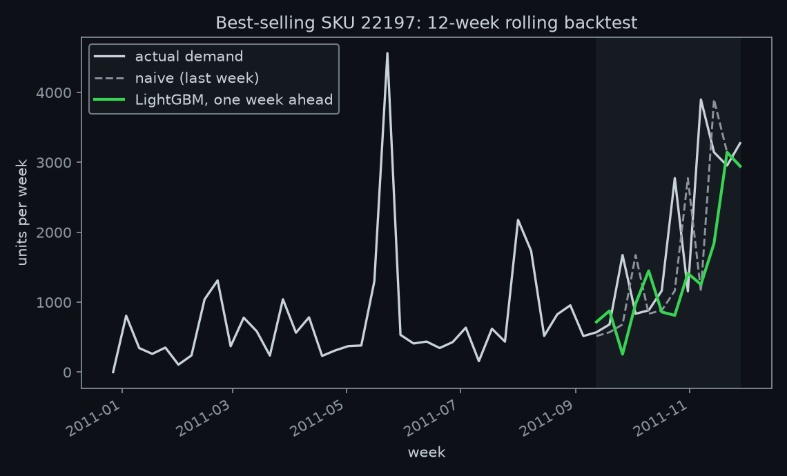
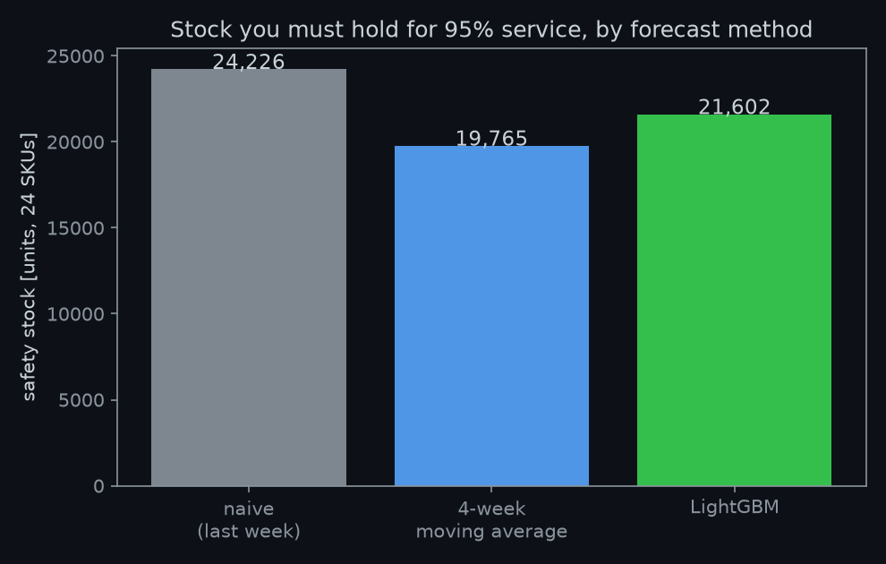

# restock

Forecast next week's demand, then answer the question a stockroom actually asks: how many units do I hold? Built on a year of real retail transactions, backtested honestly, and scored in inventory, not just error metrics. The finding: the boring model won, and this README says so instead of hiding it.

**Provenance, stated plainly.** This is a public rebuild of the supply chain half of my 2022 machine learning internship at Corizo. The original code and data are not mine to publish, so this repo reimplements the approach on the public UCI Online Retail dataset: 540,000 transactions from a UK retailer, December 2010 to December 2011, aggregated here into weekly demand for the 24 best-selling SKUs.

## The contest

One-week-ahead demand forecasts, rolled forward over the last 12 weeks. Each week, every model sees only the past, predicts the next week, and gets scored against what customers actually ordered. The challengers are the two baselines every operations team already uses without calling them models.

| Model | RMSE [units/wk] | MAE [units/wk] |
|---|---|---|
| Naive (last week's number) | 785 | 437 |
| **4-week moving average** | **641** | **362** |
| LightGBM (lags, moving average, week-of-year, SKU) | 683 | 406 |

The moving average wins. LightGBM got a fair fight, not a token one: a Tweedie objective for skewed counts (762), a log-transformed target (748), smaller trees (752), and an L1 objective (762) were all tried, and every variant still lost to the 4-week average. An adversarial review pass also caught week-of-year being fed in as a categorical the model could never match on one year of data; fixing it to numeric improved LightGBM from 748 to 683 RMSE, and the baseline still won.



The chart shows why. With one year of history, the model has never seen a holiday season, so it cannot know that November means a ramp; it under-forecasts the surge while the dumb baselines at least chase it. Gradient boosting earns its keep on years of history and hundreds of series. On 24 SKUs and 40 training weeks, it has nothing to learn that the average does not already know. Knowing which regime you are in is the actual skill.

## Forecasts are inventory decisions

Forecast error is not an abstract number; it sets the safety stock you must hold to hit a service level. At 95 percent service, safety stock per SKU is 1.645 times the forecast error sigma, and summed across the catalog the choice of forecast method becomes units on a shelf:



Switching from naive forecasting to the moving average frees 4,460 units of safety stock across 24 SKUs at the same service level. That is the sentence a plant manager cares about, and it comes from the forecast, not from the warehouse.

## Decisions, and why

- **Baselines first, and treated as opponents.** Naive and moving-average forecasting is what a stockroom does by default. A model that cannot beat them should not be deployed, and here one of them won.
- **Rolling-origin backtest, not one split.** Time series punish careless validation; every prediction here used only information available at the time.
- **Demand means orders.** Cancellations, returns, and non-product codes (postage, bank charges) are removed, and each SKU's series starts at its first sale so pre-launch zeros do not read as demand.
- **Scored in units of stock.** RMSE decides the ranking; safety stock states the consequence.
- **The losing model stays in the repo.** Deleting LightGBM after it lost would make this a story instead of an experiment.

## Stated limits

- The safety-stock conversion assumes normally distributed forecast errors (the 1.645 factor). Retail demand errors are right-skewed, so these totals illustrate the conversion; a procurement decision would use empirical quantiles.
- Each per-SKU error sigma comes from 12 backtest residuals, so the stock totals are point estimates, not tight ones.
- The backtest window covers the autumn ramp into the holidays, the hardest regime for a model that has never seen a December. In a stable season the ranking could narrow; with several years of history it could flip. That is the regime argument, and this dataset cannot settle it.
- The pinned versions in requirements.txt are mandatory, not a suggestion; the code uses pandas 3.0 APIs.

## Run it

```
python3 -m venv .venv
./.venv/bin/pip install -r requirements.txt
./.venv/bin/python restock.py
```

`data/weekly_demand.csv` is committed, so the model step runs without the 23 MB raw download. To rebuild it from source, fetch the [UCI Online Retail dataset](https://archive.ics.uci.edu/dataset/352/online+retail) (Chen, 2015) and run `python prepare_data.py "Online Retail.xlsx"`. Exact numbers shift slightly with platform and library versions; the tables above come from the committed `metrics.json`.

---

Veer Sanghvi · Mechanical Engineering, Wentworth Institute of Technology · [portfolio](https://veer-sanghvi.github.io/) · companion repo: [guzzler](https://github.com/Veer-Sanghvi/guzzler)
